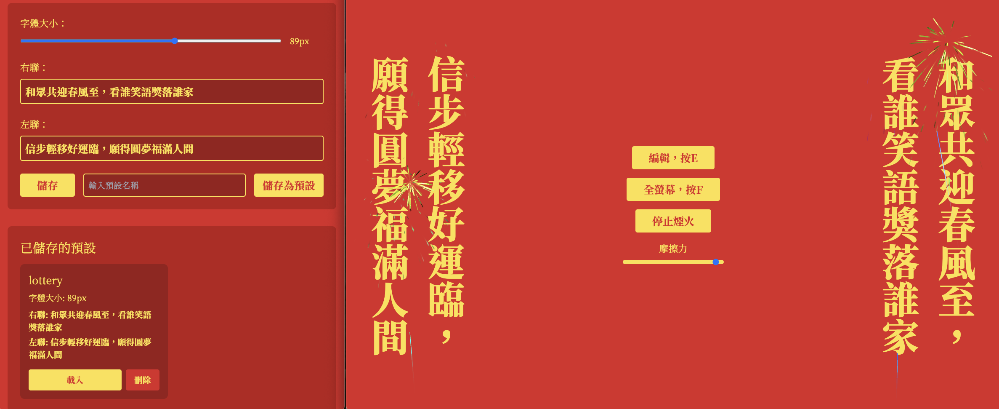

# Couple: A Poetic Couplet Display App

[Online Preview](https://chinese-couple.netlify.app/)

[中文說明](README.zhtw.md)

## Overview

Couple is an elegant web application that displays and edits Chinese couplets (對聯) with interactive features like fullscreen mode, fireworks, and synchronized text across multiple windows.

## Features

- **Dynamic Couplet Display**: View traditional Chinese couplets in a vertical, upright layout
- **Interactive Editing**: Open an editor to modify the couplet text
- **Fullscreen Mode**: Toggle fullscreen with a button or keyboard shortcut
- **Fireworks Animation**: Add festive fireworks with adjustable friction
- **Cross-Window Synchronization**: Sync couplet text and settings across different browser windows

## Keyboard Shortcuts

- `E`: Open Editor
- `F`: Toggle Fullscreen
- `X`: Toggle Fireworks

## Technologies

- React
- TypeScript
- Tailwind CSS
- React Router
- Fireworks.js

## Local Development

1. Clone the repository
2. Install dependencies: `npm install`
3. Start the development server: `npm start`

## Dependencies

- `@fireworks-js/react`: For fireworks animation
- `react-router-dom`: For routing
- `tailwindcss`: For styling

## Customization

You can customize:
- Couplet text
- Font size
- Fireworks friction
- Color scheme

## Inspiration

Inspired by traditional Chinese poetry and the beauty of linguistic symmetry.

## License

MIT License